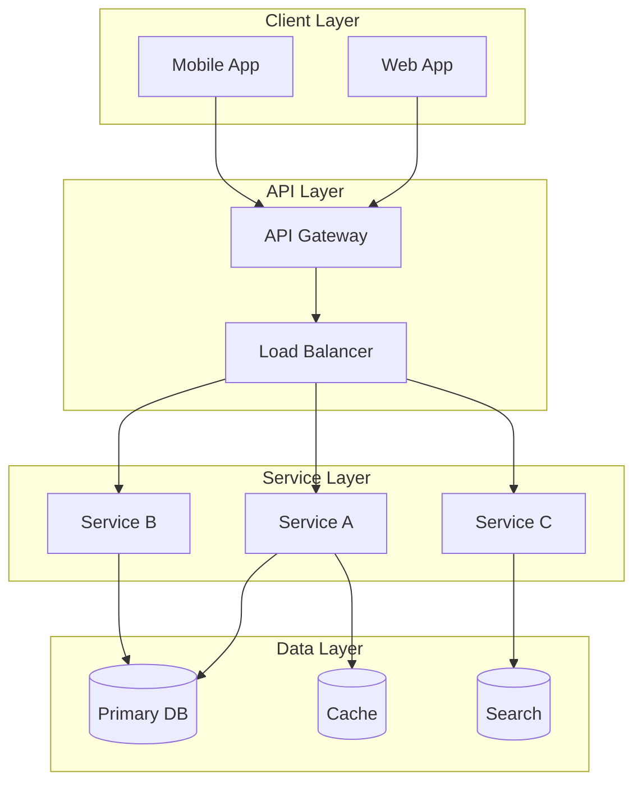
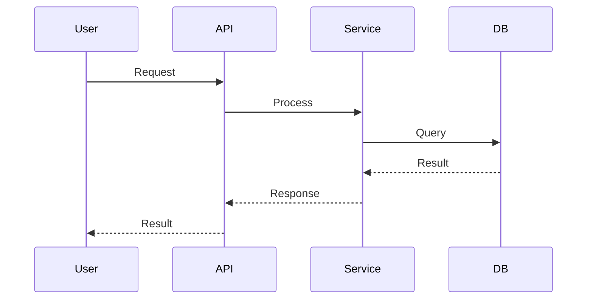
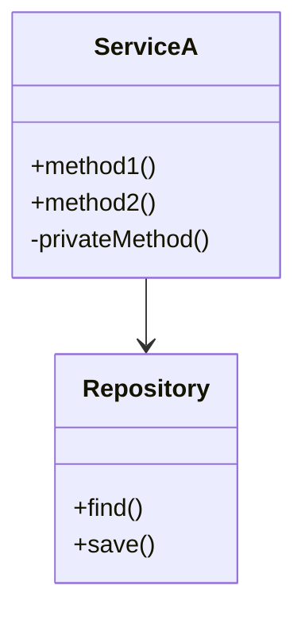
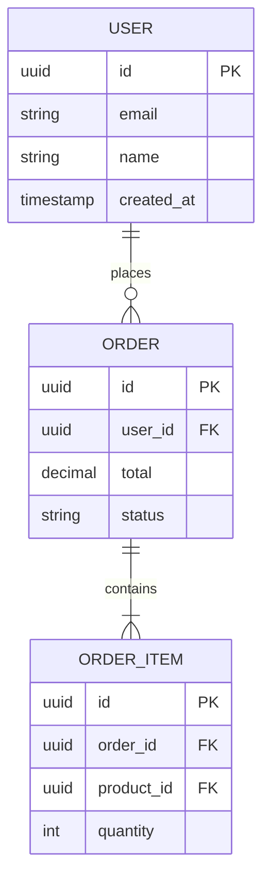
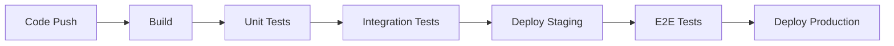

# Design Document Generation
# Usage: Generate design document from requirements: <PRD_PATH> [BRD_PATH] [ADDITIONAL_DOCS...]

# Parse inputs
Set DOCUMENT_PATHS to $Arguments
Validate that at least one document path is provided, otherwise error "Please provide path(s) to requirement documents (PRD, BRD)"

## Objective
Create a comprehensive developer design document based on the provided product and business requirement documents.

---

## Phase 1: Document Analysis (Execute in Parallel)

### Stream A: Requirements Extraction
- Read all provided PRD/BRD documents
- Extract functional requirements (user stories, features)
- Extract non-functional requirements (performance, security, scalability)
- Identify acceptance criteria for each requirement

### Stream B: Constraint Analysis
- Identify technical constraints mentioned
- Note integration requirements with existing systems
- Extract compliance/regulatory requirements
- List explicitly stated assumptions

### Stream C: Gap Analysis
- Flag ambiguous or incomplete requirements
- Identify missing information needed for design
- Note conflicting requirements
- List questions for stakeholders

---

## Phase 2: Design Document Generation

Generate the following document structure:

---

# [Project Name] - Technical Design Document

| Field | Value |
|-------|-------|
| **Version** | 1.0 |
| **Author** | [Generated by AI] |
| **Date** | [Current Date] |
| **Status** | Draft |
| **PRD Version** | [From source] |

## Table of Contents
1. [Executive Summary](#1-executive-summary)
2. [Requirements Analysis](#2-requirements-analysis)
3. [System Architecture](#3-system-architecture)
4. [Detailed Design](#4-detailed-design)
5. [Data Design](#5-data-design)
6. [API Design](#6-api-design)
7. [Security Design](#7-security-design)
8. [Testing Strategy](#8-testing-strategy)
9. [Deployment Strategy](#9-deployment-strategy)
10. [Monitoring & Observability](#10-monitoring--observability)
11. [Task Breakdown](#11-task-breakdown)
12. [Risk Assessment](#12-risk-assessment)
13. [Open Questions](#13-open-questions)

---

## 1. Executive Summary

### 1.1 Overview
[2-3 paragraphs describing the project, its purpose, and key objectives]

### 1.2 Key Stakeholders
| Role | Responsibility |
|------|----------------|
| Product Owner | [Name/Team] |
| Tech Lead | [Name/Team] |
| End Users | [Description] |

### 1.3 Scope
**In Scope:**
- [Feature/capability 1]
- [Feature/capability 2]

**Out of Scope:**
- [Excluded item 1]
- [Excluded item 2]

### 1.4 Success Metrics
| Metric | Target | Measurement Method |
|--------|--------|-------------------|
| [Metric 1] | [Target] | [How to measure] |

---

## 2. Requirements Analysis

### 2.1 Requirements Traceability Matrix
| Req ID | Description | Type | Priority | Design Section | Status |
|--------|-------------|------|----------|----------------|--------|
| REQ-001 | [Description] | Functional | P0 | [Section ref] | Addressed |
| REQ-002 | [Description] | Non-Functional | P1 | [Section ref] | Addressed |
| REQ-003 | [Description] | Functional | P0 | - | Gap Identified |

### 2.2 Functional Requirements

#### Feature Area 1: [Name]
| ID | Requirement | Acceptance Criteria | Priority |
|----|-------------|---------------------|----------|
| FR-001 | [Description] | [Criteria] | P0/P1/P2 |

#### Feature Area 2: [Name]
| ID | Requirement | Acceptance Criteria | Priority |
|----|-------------|---------------------|----------|
| FR-002 | [Description] | [Criteria] | P0/P1/P2 |

### 2.3 Non-Functional Requirements
| Category | Requirement | Target | Rationale |
|----------|-------------|--------|-----------|
| Performance | Response time | < 200ms p95 | [From PRD] |
| Scalability | Concurrent users | 10,000 | [From PRD] |
| Availability | Uptime | 99.9% | [From PRD] |
| Security | Authentication | OAuth 2.0 | [From PRD] |

### 2.4 Constraints
| Type | Constraint | Impact |
|------|------------|--------|
| Technical | [Constraint] | [How it affects design] |
| Business | [Constraint] | [How it affects design] |
| Regulatory | [Constraint] | [How it affects design] |

---

## 3. System Architecture

### 3.1 Architecture Overview
[Description of chosen architecture pattern and rationale]

### 3.2 Architecture Diagram


### 3.3 Component Breakdown
| Component | Responsibility | Technology | Interfaces |
|-----------|----------------|------------|------------|
| [Component] | [What it does] | [Tech stack] | [APIs/Events] |

### 3.4 Data Flow


### 3.5 Technology Stack
| Layer | Technology | Version | Justification |
|-------|------------|---------|---------------|
| Frontend | [Tech] | [Ver] | [Why chosen] |
| Backend | [Tech] | [Ver] | [Why chosen] |
| Database | [Tech] | [Ver] | [Why chosen] |
| Cache | [Tech] | [Ver] | [Why chosen] |
| Queue | [Tech] | [Ver] | [Why chosen] |

---

## 4. Detailed Design

### 4.1 Component: [Name]

#### Purpose
[What this component does]

#### Class/Module Diagram


#### Key Algorithms
```
Algorithm: [Name]
Input: [Parameters]
Output: [Return value]

1. [Step 1]
2. [Step 2]
3. [Step 3]

Complexity: O(n)
```

#### Error Handling
| Error Condition | Response | Recovery |
|-----------------|----------|----------|
| [Condition] | [HTTP code/message] | [How to recover] |

---

## 5. Data Design

### 5.1 Entity Relationship Diagram


### 5.2 Database Schema
| Table | Column | Type | Constraints | Description |
|-------|--------|------|-------------|-------------|
| users | id | UUID | PK | User identifier |
| users | email | VARCHAR(255) | UNIQUE, NOT NULL | User email |
| users | created_at | TIMESTAMP | NOT NULL | Creation time |

### 5.3 Indexes
| Table | Index Name | Columns | Type | Rationale |
|-------|------------|---------|------|-----------|
| users | idx_users_email | email | UNIQUE | Email lookups |
| orders | idx_orders_user_id | user_id | B-TREE | User order queries |

### 5.4 Data Migration Strategy
| Migration | Description | Rollback Plan | Risk |
|-----------|-------------|---------------|------|
| [Migration 1] | [What it does] | [How to rollback] | Low/Med/High |

---

## 6. API Design

### 6.1 API Overview
| Endpoint | Method | Purpose | Auth Required |
|----------|--------|---------|---------------|
| /api/v1/users | GET | List users | Yes |
| /api/v1/users | POST | Create user | Yes |
| /api/v1/users/{id} | GET | Get user | Yes |

### 6.2 Endpoint Specifications

#### POST /api/v1/users
**Description**: Create a new user

**Request**:
```json
{
  "email": "string (required)",
  "name": "string (required)",
  "role": "string (optional, default: 'user')"
}
```

**Response (201)**:
```json
{
  "id": "uuid",
  "email": "string",
  "name": "string",
  "created_at": "ISO8601 timestamp"
}
```

**Error Responses**:
| Code | Condition | Response |
|------|-----------|----------|
| 400 | Invalid input | `{"error": "validation_error", "details": [...]}` |
| 409 | Email exists | `{"error": "duplicate_email"}` |
| 500 | Server error | `{"error": "internal_error"}` |

### 6.3 API Versioning Strategy
[Description of versioning approach: URL path, header, etc.]

---

## 7. Security Design

### 7.1 Authentication
| Aspect | Implementation |
|--------|----------------|
| Method | [OAuth 2.0 / JWT / etc.] |
| Token Storage | [Where tokens stored] |
| Session Duration | [Duration] |
| Refresh Strategy | [How tokens refreshed] |

### 7.2 Authorization
| Role | Permissions | Scope |
|------|-------------|-------|
| Admin | Full access | All resources |
| User | Read/Write own | Own resources |
| Guest | Read only | Public resources |

### 7.3 Data Protection
| Data Type | Protection Method | Notes |
|-----------|-------------------|-------|
| Passwords | bcrypt (cost 12) | Never stored plain |
| PII | AES-256 encryption | At rest |
| API Keys | Hashed | SHA-256 |

### 7.4 Security Checklist
- [ ] OWASP Top 10 addressed
- [ ] Input validation on all endpoints
- [ ] SQL injection prevention
- [ ] XSS prevention
- [ ] CSRF protection
- [ ] Rate limiting implemented
- [ ] Security headers configured

---

## 8. Testing Strategy

### 8.1 Test Coverage Targets
| Test Type | Coverage Target | Tools |
|-----------|-----------------|-------|
| Unit | 80% | [Jest/JUnit/etc.] |
| Integration | 70% | [Tool] |
| E2E | Critical paths | [Cypress/Playwright] |

### 8.2 Test Scenarios
| Scenario | Type | Priority | Automated |
|----------|------|----------|-----------|
| User registration flow | E2E | P0 | Yes |
| API error handling | Integration | P0 | Yes |
| Edge case: empty input | Unit | P1 | Yes |

### 8.3 Performance Testing
| Test | Target | Tool |
|------|--------|------|
| Load test | 1000 concurrent users | k6/JMeter |
| Stress test | Find breaking point | k6/JMeter |
| Soak test | 24 hour stability | k6/JMeter |

---

## 9. Deployment Strategy

### 9.1 Deployment Pipeline


### 9.2 Environment Configuration
| Environment | Purpose | Infrastructure |
|-------------|---------|----------------|
| Development | Local dev | Docker Compose |
| Staging | Pre-prod testing | [Cloud/K8s] |
| Production | Live system | [Cloud/K8s] |

### 9.3 Rollback Plan
| Trigger | Action | RTO |
|---------|--------|-----|
| Failed health check | Auto rollback | < 5 min |
| Error rate > 5% | Manual decision | < 15 min |
| Customer report | Investigation | < 1 hour |

### 9.4 Feature Flags
| Flag | Purpose | Default | Rollout Strategy |
|------|---------|---------|------------------|
| [feature_x] | [Purpose] | Off | 10% -> 50% -> 100% |

---

## 10. Monitoring & Observability

### 10.1 Metrics (SLIs)
| Metric | Target (SLO) | Alert Threshold |
|--------|--------------|-----------------|
| Latency p95 | < 200ms | > 500ms |
| Error rate | < 0.1% | > 1% |
| Availability | 99.9% | < 99.5% |

### 10.2 Logging Strategy
| Log Level | When to Use | Retention |
|-----------|-------------|-----------|
| ERROR | Failures requiring attention | 90 days |
| WARN | Potential issues | 30 days |
| INFO | Business events | 14 days |
| DEBUG | Development only | 7 days |

### 10.3 Dashboards
| Dashboard | Audience | Key Metrics |
|-----------|----------|-------------|
| Operations | SRE/DevOps | Uptime, errors, latency |
| Business | Product | Users, conversions, revenue |

---

## 11. Task Breakdown

### 11.1 Implementation Phases

#### Phase 1: Foundation (P0)
| Task | Description | Estimate | Dependencies | Assignee |
|------|-------------|----------|--------------|----------|
| T-001 | Set up project structure | S | None | |
| T-002 | Configure CI/CD pipeline | M | T-001 | |
| T-003 | Implement database schema | M | T-001 | |

#### Phase 2: Core Features (P0)
| Task | Description | Estimate | Dependencies | Assignee |
|------|-------------|----------|--------------|----------|
| T-004 | Implement user service | L | T-003 | |
| T-005 | Implement auth flow | L | T-003, T-004 | |

#### Phase 3: Enhanced Features (P1)
| Task | Description | Estimate | Dependencies | Assignee |
|------|-------------|----------|--------------|----------|
| T-006 | [Feature] | M | T-005 | |

### 11.2 Critical Path
```
T-001 → T-003 → T-004 → T-005 → [Launch]
```

### 11.3 Effort Estimates
| Size | Definition | Typical Duration |
|------|------------|------------------|
| S | Simple, well-understood | 1-2 days |
| M | Some complexity | 3-5 days |
| L | Complex, multiple components | 1-2 weeks |
| XL | Very complex, unknowns | 2-4 weeks |

---

## 12. Risk Assessment

### 12.1 Risk Register
| ID | Risk | Probability | Impact | Score | Mitigation | Contingency |
|----|------|-------------|--------|-------|------------|-------------|
| R-001 | [Risk description] | High/Med/Low | High/Med/Low | [P×I] | [Preventive action] | [If it happens] |
| R-002 | Third-party API unavailable | Medium | High | 6 | Implement retry logic, circuit breaker | Fallback to cached data |

### 12.2 Dependencies
| Dependency | Type | Risk Level | Mitigation |
|------------|------|------------|------------|
| [External API] | External | Medium | Contract, SLA monitoring |
| [Team X] | Internal | Low | Regular sync meetings |

### 12.3 Assumptions
| ID | Assumption | Impact if Wrong | Validation |
|----|------------|-----------------|------------|
| A-001 | [Assumption] | [Impact] | [How to validate] |

---

## 13. Open Questions

### 13.1 Questions for Stakeholders
| ID | Question | Context | Blocking | Asked To |
|----|----------|---------|----------|----------|
| Q-001 | [Question] | [Why it matters] | Yes/No | [Person/Team] |

### 13.2 Technical Decisions Needed
| Decision | Options | Recommendation | Status |
|----------|---------|----------------|--------|
| [Decision needed] | A, B, C | [Recommended option with rationale] | Pending |

### 13.3 Information Gaps
| Gap | Impact on Design | How to Resolve |
|-----|------------------|----------------|
| [Missing info] | [What can't be designed] | [Next steps] |

---

## Appendix

### A. Glossary
| Term | Definition |
|------|------------|
| [Term] | [Definition] |

### B. References
- [Link to PRD]
- [Link to related design docs]
- [Link to relevant RFCs/standards]

### C. Revision History
| Version | Date | Author | Changes |
|---------|------|--------|---------|
| 1.0 | [Date] | [AI Generated] | Initial draft |

---

## Document Verification Checklist

Before finalizing, verify:
- [ ] All PRD requirements are traced to design sections
- [ ] No features added that aren't in the PRD
- [ ] All diagrams render correctly
- [ ] API specifications are complete
- [ ] Security considerations addressed
- [ ] All open questions documented
- [ ] Task breakdown covers all requirements
- [ ] Risk assessment is comprehensive

---

## Usage

```bash
/design-doc path/to/prd.md
/design-doc path/to/prd.md path/to/brd.md
/design-doc path/to/prd.md path/to/technical-constraints.md
```

Or paste the content of your requirement documents after invoking the command.
