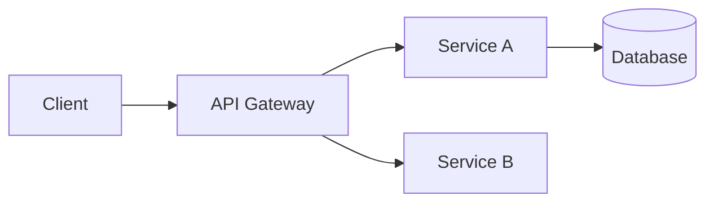

# API Discovery and Documentation Command
# Usage: Discover and document APIs in the codebase: <DIRECTORY|FILE_PATTERN|SERVICE_NAME>

# Parse and validate the target identifier
Set TARGET to $Arguments
Validate that TARGET is provided, otherwise error "Please provide a directory, file pattern, or service name to analyze"

# Step 1: API Discovery
## Scan codebase for API definitions
Execute these searches in parallel:
- Search for REST controllers (@RestController, @Controller, @RequestMapping)
- Search for GraphQL endpoints (@QueryMapping, @MutationMapping, schema files)
- Search for gRPC service definitions (.proto files)
- Search for WebSocket endpoints (@MessageMapping)
- Search for OpenAPI/Swagger annotations (@Api, @Operation, @ApiOperation)
- Search for route definitions in framework-specific patterns (Express routes, FastAPI, Flask)

# Step 2: Endpoint Analysis
For each discovered endpoint, extract:
- HTTP method (GET, POST, PUT, DELETE, PATCH)
- URL path and path parameters
- Query parameters and their types
- Request body schema and validation rules
- Response types and status codes
- Authentication/authorization requirements
- Rate limiting or throttling configurations
- Middleware or interceptors applied

# Step 3: Dependency Mapping
## Analyze API relationships
- Internal service-to-service calls (Feign clients, RestTemplate, WebClient)
- External API integrations
- Database queries triggered by each endpoint
- Event publishing/subscribing patterns
- Caching layers involved

# Step 4: Categorize API Findings

## CRITICAL (Documentation Required)
- Public-facing APIs without documentation
- APIs handling sensitive data without proper security annotations
- Breaking changes in existing APIs
- Deprecated endpoints still in use

## HIGH (Should Document)
- Internal APIs used by multiple services
- APIs with complex business logic
- Endpoints with non-obvious side effects

## MEDIUM (Nice to Document)
- Administrative endpoints
- Health check and monitoring endpoints
- Utility APIs

# Step 5: Generate API Documentation

## Output Format

### API Inventory Summary
| Endpoint | Method | Path | Auth | Description |
|----------|--------|------|------|-------------|
| [Name] | [GET/POST/etc] | [/api/path] | [Yes/No] | [Brief description] |

### Detailed API Documentation

#### [Endpoint Name]
- **Method**: [HTTP Method]
- **Path**: [Full path with parameters]
- **Description**: [What this endpoint does]
- **Authentication**: [Required auth mechanism]
- **Authorization**: [Required roles/permissions]

**Request**
```
Headers:
  - [Header]: [Description]

Path Parameters:
  - [param]: [type] - [description]

Query Parameters:
  - [param]: [type] - [description] (required/optional)

Body:
{
  "field": "type - description"
}
```

**Response**
```
Success (200):
{
  "field": "type - description"
}

Error Responses:
- 400: [When this occurs]
- 401: [When this occurs]
- 404: [When this occurs]
```

**Example**
```bash
curl -X [METHOD] "[URL]" \
  -H "Authorization: Bearer [token]" \
  -d '{"field": "value"}'
```

### API Dependency Graph


### Security Findings
- List any endpoints missing authentication
- Identify endpoints with overly permissive access
- Note any sensitive data exposure risks

### Recommendations
- Missing documentation to add
- Versioning strategy suggestions
- Rate limiting recommendations
- Deprecation candidates
