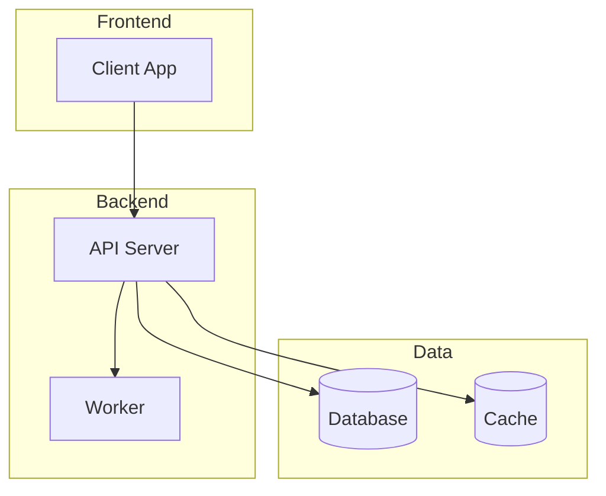

# Comprehensive Codebase Analysis & Onboarding Documentation
# Usage: Analyze codebase and generate onboarding documentation

## Objective
Perform an exhaustive analysis of this codebase to create a comprehensive onboarding document that enables new developers to understand the system quickly and effectively.

## Analysis Strategy

### Phase 1: Rapid Discovery (Execute in Parallel)

Run these discovery tasks simultaneously:

**Group 1: Project Structure**
```bash
# Get directory structure
find . -type f -name "*.json" -o -name "*.yaml" -o -name "*.yml" | head -20
ls -la
cat package.json OR cat pom.xml OR cat build.gradle OR cat Cargo.toml (detect project type)
```

**Group 2: Entry Points**
```bash
# Find main entry points
grep -r "main\|entry\|start\|bootstrap" --include="*.json" .
find . -name "main.*" -o -name "index.*" -o -name "app.*" -o -name "server.*"
```

**Group 3: Configuration**
```bash
# Find config files
find . -name "*.env*" -o -name "*.config.*" -o -name "docker-compose*"
find . -name "Dockerfile" -o -name "*.yaml" -o -name "*.yml"
```

**Group 4: Documentation**
```bash
# Find existing docs
find . -name "README*" -o -name "*.md" -o -name "docs"
find . -name "CONTRIBUTING*" -o -name "CHANGELOG*"
```

### Phase 2: Deep Code Analysis (Parallel Streams)

Execute these analysis streams concurrently:

**Stream A: Architecture Analysis**
- Identify architectural patterns (MVC, microservices, monolith, etc.)
- Map module dependencies and relationships
- Trace data flow from entry to exit points
- Identify external integrations (APIs, databases, services)

**Stream B: Source Code Analysis**
- Read and understand core business logic
- Identify design patterns in use
- Note coding conventions and style
- Flag complex algorithms or non-obvious logic

**Stream C: Test Analysis**
- Analyze test structure and coverage
- Identify testing strategies (unit, integration, e2e)
- Note any failing or disabled tests
- Assess test quality and maintainability

**Stream D: Documentation Analysis**
- Review all README files
- Check inline code comments
- Find API documentation
- Identify documentation gaps

### Phase 3: Synthesis

Merge findings from all streams and create the onboarding document.

---

## Output: onboarding.md Structure

Generate a single `onboarding.md` file with these sections:

### 1. Quick Start (Most Important - Put First)
```markdown
## Quick Start

### Prerequisites
- [Required tools and versions]

### Setup (< 5 minutes)
1. Clone: `git clone [repo]`
2. Install: `[package manager] install`
3. Configure: `cp .env.example .env`
4. Run: `[command to start]`

### Verify It Works
- Visit: http://localhost:[port]
- Run tests: `[test command]`
```

### 2. What Is This? (Executive Summary)
| Field | Value |
|-------|-------|
| **Purpose** | [One sentence description] |
| **Users** | [Who uses this] |
| **Problem Solved** | [What problem it solves] |
| **Tech Stack** | [Primary technologies] |

[2-3 paragraph detailed description]

### 3. Architecture Overview

#### System Diagram


#### Key Components
| Component | Location | Responsibility |
|-----------|----------|----------------|
| [Name] | `src/[path]` | [What it does] |

#### Data Flow
1. [Step 1: Request comes in...]
2. [Step 2: Processing happens...]
3. [Step 3: Response returned...]

### 4. Technology Stack
| Category | Technology | Version | Purpose |
|----------|------------|---------|---------|
| Language | [e.g., TypeScript] | [version] | [why chosen] |
| Framework | [e.g., Express] | [version] | [why chosen] |
| Database | [e.g., PostgreSQL] | [version] | [why chosen] |
| Cache | [e.g., Redis] | [version] | [why chosen] |
| Testing | [e.g., Jest] | [version] | [why chosen] |

### 5. Project Structure
```
/
├── src/
│   ├── api/          # REST API endpoints
│   ├── services/     # Business logic
│   ├── models/       # Data models
│   ├── utils/        # Shared utilities
│   └── config/       # Configuration
├── tests/            # Test files
├── docs/             # Documentation
└── scripts/          # Build/deploy scripts
```

### 6. Key Concepts & Patterns
| Concept | Description | Example Location |
|---------|-------------|------------------|
| [Pattern name] | [Brief explanation] | `src/[file]:[line]` |

### 7. Common Tasks

#### Adding a New Feature
1. [Step 1]
2. [Step 2]
3. [Step 3]

#### Adding a New API Endpoint
1. [Step 1]
2. [Step 2]

#### Running Tests
```bash
# All tests
[command]

# Specific test
[command]

# With coverage
[command]
```

#### Debugging
- [How to debug locally]
- [Key log locations]
- [Common issues and solutions]

### 8. Entry Points & Important Files
| File | Purpose | When You'd Modify It |
|------|---------|---------------------|
| `src/index.ts` | Application entry | Rarely |
| `src/routes/` | API routes | Adding endpoints |
| `src/services/` | Business logic | Adding features |
| `src/config/` | Configuration | Environment changes |

### 9. External Dependencies & Integrations
| Service | Purpose | Config Location | Documentation |
|---------|---------|-----------------|---------------|
| [Service] | [Why used] | `[config file]` | [Link] |

### 10. Issues & Technical Debt

#### 🔴 CRITICAL
| Issue | Location | Impact | Suggested Fix | Effort |
|-------|----------|--------|---------------|--------|
| [Issue] | `[file:line]` | [Impact] | [Fix] | [S/M/L] |

#### 🟠 HIGH
| Issue | Location | Impact | Suggested Fix | Effort |
|-------|----------|--------|---------------|--------|

#### 🟡 MEDIUM
| Issue | Location | Impact | Suggested Fix | Effort |
|-------|----------|--------|---------------|--------|

#### 🟢 LOW
[Bullet list for minor items]

### 11. Glossary
| Term | Definition |
|------|------------|
| [Domain term] | [What it means in this codebase] |

### 12. Resources & References
- [Link to API docs]
- [Link to design docs]
- [Link to runbooks]
- [Team contacts]

---

## Analysis Instructions

### Efficiency Guidelines
1. **Start with package files** - They reveal the tech stack immediately
2. **Find entry points first** - Follow the code flow from there
3. **Use parallel analysis** - Run multiple searches simultaneously
4. **Prioritize by impact** - Focus on core business logic first
5. **Skip generated code** - Don't analyze node_modules, dist, build folders

### Search Patterns to Use
```bash
# Find main logic
grep -r "class\|function\|export" --include="*.ts" --include="*.js" src/

# Find API endpoints
grep -r "@Get\|@Post\|router\.\|app\." --include="*.ts" --include="*.js" .

# Find database operations
grep -r "query\|find\|save\|update\|delete" --include="*.ts" --include="*.js" src/

# Find configuration
grep -r "process.env\|config\." --include="*.ts" --include="*.js" src/

# Find error handling
grep -r "catch\|throw\|Error" --include="*.ts" --include="*.js" src/
```

### Quality Checklist
Before finalizing, verify:
- [ ] Quick Start section is complete and tested
- [ ] Architecture diagram renders correctly
- [ ] All file paths are accurate
- [ ] Issues have specific locations and fixes
- [ ] No jargon without explanation
- [ ] Document is actionable, not just descriptive

### Success Criteria
A new developer should be able to:
1. ✅ Set up and run the project in < 15 minutes
2. ✅ Understand what the system does in < 5 minutes
3. ✅ Find any component in < 2 minutes
4. ✅ Make their first change in < 1 day
5. ✅ Know where technical debt exists

---

**Now, analyze this codebase and generate the comprehensive onboarding.md document.**
