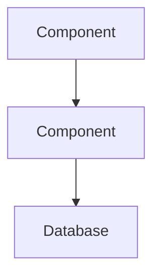

# Comprehensive Codebase Analysis & Onboarding Documentation

## Objective
Perform an exhaustive analysis of this codebase to create a comprehensive onboarding document that enables new developers to understand the system quickly and effectively.

## Analysis Requirements

### Phase 1: Deep Code Analysis
1. **Examine ALL code files** in the repository:
   - Read and analyze every source file, understanding the purpose and relationships
   - Study the control flow, data flow, and dependencies between modules
   - Identify design patterns, architectural decisions, and coding conventions
   - Note any complex algorithms, performance optimizations, or technical debt

2. **Review ALL tests**:
   - Analyze unit tests, integration tests, and end-to-end tests
   - Understand test coverage and testing strategies
   - Identify gaps in test coverage
   - Note any failing, flaky, or disabled tests

3. **Study ALL documentation**:
   - Review README files, API documentation, and inline comments
   - Analyze configuration files and their purposes
   - Examine any architectural decision records (ADRs)
   - Note discrepancies between documentation and actual implementation

4. **Evaluate code comments**:
   - Assess the quality and accuracy of inline comments
   - Identify outdated or misleading comments
   - Note missing documentation for complex logic

### Phase 2: Synthesis & Documentation

Create an `onboarding.md` file with the following sections:

#### 1. Executive Summary (2-3 paragraphs)
- What does this application/system do?
- Who are the primary users?
- What problem does it solve?

#### 2. Architecture Overview
- **High-Level Architecture**: Describe the overall system design
- **Key Components**: List and explain major modules/services
- **Data Flow**: Explain how data moves through the system
- **External Dependencies**: APIs, databases, third-party services

#### 3. Architecture Diagram
Create a clear ASCII or Mermaid diagram showing:
- System components and their relationships
- Data flow between components
- External integrations
- Database/storage layers

Example format:


#### 4. Technology Stack
Organize by category:
- **Languages**: Programming languages used
- **Frameworks**: Web frameworks, testing frameworks
- **Libraries**: Key dependencies and their purposes
- **Infrastructure**: Databases, message queues, caching
- **DevOps**: CI/CD, containerization, orchestration
- **Development Tools**: Build tools, linters, formatters

#### 5. Project Structure
```
/src
  /components - Brief description
  /services - Brief description
  /utils - Brief description
```

#### 6. Key Concepts & Patterns
- Design patterns employed
- Important abstractions or domain concepts
- Coding conventions and style guide adherence

#### 7. Development Workflow
- How to set up the development environment
- How to run the application locally
- How to run tests
- How to build and deploy

#### 8. Issues & Improvements

##### 🔴 CRITICAL Priority
List issues that:
- Could cause data loss or security vulnerabilities
- Block core functionality
- Violate critical business requirements

##### 🟠 HIGH Priority
List issues that:
- Significantly impact user experience
- Cause frequent errors or failures
- Create substantial technical debt

##### 🟡 MEDIUM Priority
List issues that:
- Impact code maintainability
- Reduce developer productivity
- Need refactoring for clarity

##### 🟢 LOW Priority
List issues that:
- Are cosmetic or style-related
- Minor optimization opportunities
- Nice-to-have improvements

**For each issue, provide:**
- **Issue**: Clear description of the problem
- **Location**: File(s) and line numbers
- **Impact**: Why this matters
- **Suggestion**: Specific recommendation to fix
- **Effort**: Estimated complexity (Small/Medium/Large)

### Phase 3: Quality Checks

Before finalizing, verify:
- [ ] All sections are complete and accurate
- [ ] Architecture diagram is clear and renders correctly
- [ ] Issues are specific with actionable suggestions
- [ ] Technical terms are explained for newcomers
- [ ] Document is concise (aim for one page, max two if complex)
- [ ] No assumptions about prior knowledge of the codebase

## Analysis Instructions

1. **Think deeply** before writing. Consider:
   - How would a new developer approach this codebase?
   - What are the most confusing or complex parts?
   - What context is missing from the documentation?

2. **Be thorough** in your analysis:
   - Don't just skim—read and understand each file
   - Follow function calls and trace execution paths
   - Understand the "why" behind architectural decisions

3. **Be specific** in your findings:
   - Reference exact file names and line numbers
   - Provide concrete examples of issues
   - Give actionable recommendations, not vague suggestions

4. **Be honest** about issues:
   - Don't sugarcoat problems
   - Prioritize based on actual impact, not severity of wording
   - Acknowledge well-designed parts of the codebase too

5. **Be concise** in your writing:
   - Use clear, direct language
   - Avoid jargon where possible, explain it where necessary
   - Make every sentence count

## Output Format

Generate a single `onboarding.md` file that:
- Uses Markdown formatting for readability
- Includes a table of contents with links
- Uses appropriate headers, lists, and code blocks
- Includes diagrams (Mermaid preferred, ASCII acceptable)
- Fits within 2 pages when printed (prefer 1 page)
- Is immediately useful to a new team member

## Success Criteria

A successful onboarding document should enable a new developer to:
1. Understand what the system does and why it exists
2. Navigate the codebase confidently
3. Make their first contribution within days, not weeks
4. Understand where technical debt exists
5. Know what tools and technologies they need to learn

---

**Now, analyze this codebase and generate the comprehensive onboarding.md document.**