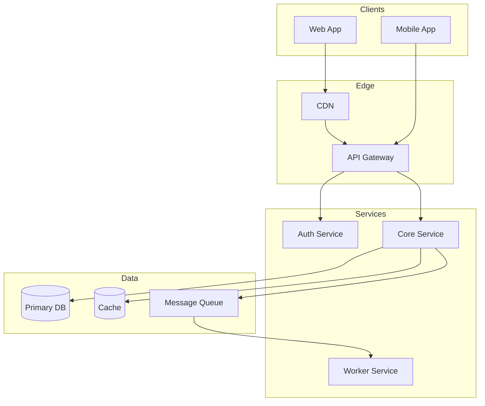
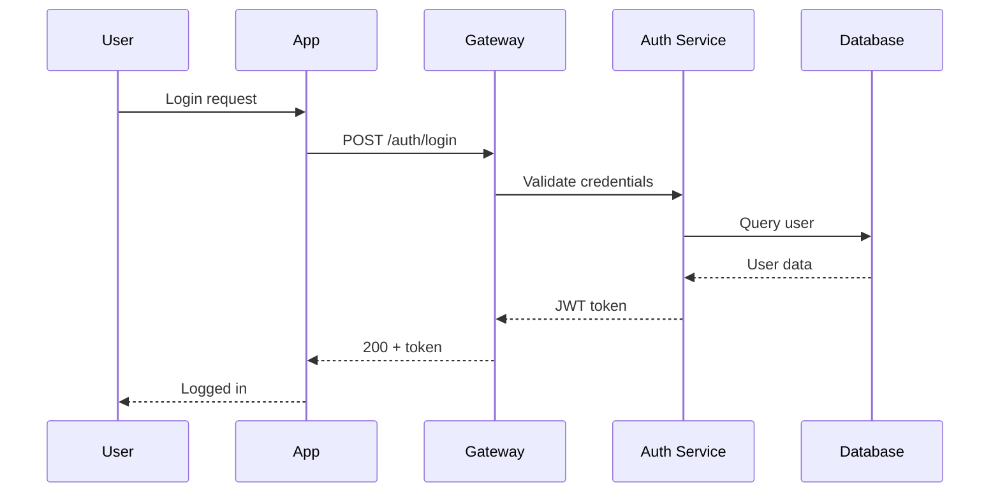
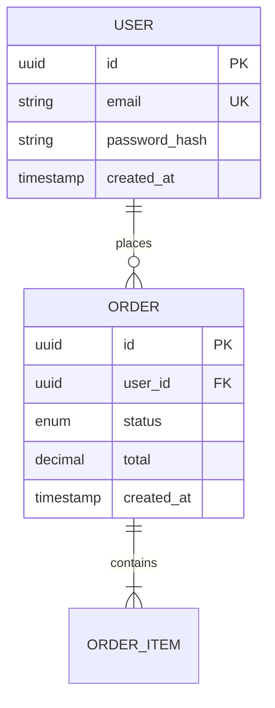

# Design Document Generation with Full Traceability
# Usage: Generate design document from requirements: <PRD_PATH> [BRD_PATH] [ADDITIONAL_DOCS...]

# Parse inputs
Set DOCUMENT_PATHS to $Arguments
Validate that at least one document path is provided, otherwise error "Please provide path(s) to requirement documents (PRD, BRD)"

## Objective
Create a comprehensive developer design document with full bidirectional traceability between requirements and design elements.

---

## Phase 1: Document Analysis (Execute in Parallel)

### Stream A: Requirements Extraction
- Read all PRD/BRD documents
- Extract functional requirements with IDs
- Extract non-functional requirements
- Capture acceptance criteria
- Note priority levels (P0/P1/P2/P3)

### Stream B: Constraint Mining
- Technical constraints
- Budget/timeline constraints
- Regulatory/compliance requirements
- Integration constraints
- Resource constraints

### Stream C: Gap Detection
- Ambiguous requirements
- Missing information
- Conflicting requirements
- Unstated assumptions
- Questions for stakeholders

---

## Phase 2: Design Document Generation

---

# [Project Name] - Technical Design Document

## Document Metadata
| Field | Value |
|-------|-------|
| **Version** | 1.0 |
| **Date** | [Current Date] |
| **Status** | Draft |
| **Source Documents** | [List PRD/BRD with versions] |
| **Requirements Count** | Functional: X, Non-Functional: Y |
| **Coverage** | X% addressed, Y% partial, Z% gaps |
| **Critical Gaps** | [Count] |
| **Confidence** | High / Medium / Low |

---

## Table of Contents
1. [Executive Summary](#1-executive-summary)
2. [Requirements Traceability](#2-requirements-traceability)
3. [System Architecture](#3-system-architecture)
4. [Data Design](#4-data-design)
5. [API Design](#5-api-design)
6. [Security Design](#6-security-design)
7. [Testing Strategy](#7-testing-strategy)
8. [Deployment & Operations](#8-deployment--operations)
9. [Task Breakdown](#9-task-breakdown)
10. [Risk Assessment](#10-risk-assessment)
11. [Open Questions](#11-open-questions)
12. [Validation Report](#12-validation-report)

---

## 1. Executive Summary

### 1.1 Overview
[2-3 paragraphs: Project purpose, objectives, key stakeholders]

### 1.2 Scope
| In Scope | Out of Scope |
|----------|--------------|
| [Feature] `[PRD §X]` | [Excluded item] |

### 1.3 Key Constraints
| Type | Constraint | Source | Impact |
|------|------------|--------|--------|
| Technical | [Constraint] | `[BRD p.X]` | [Design impact] |
| Timeline | [Constraint] | | |
| Budget | [Constraint] | | |

---

## 2. Requirements Traceability

### 2.1 Traceability Matrix
| Req ID | Source | Description | Type | Priority | Design Section | Status | Notes |
|--------|--------|-------------|------|----------|----------------|--------|-------|
| REQ-001 | `[PRD §3.2]` | [Summary] | Functional | P0 | §3.2, §5.1 | ✓ | |
| REQ-002 | `[BRD p.5]` | [Summary] | NFR | P0 | §3.4 | ⚠ | Needs HA clarity |
| REQ-003 | `[PRD §4.1]` | [Summary] | Functional | P1 | - | ✗ | Blocked by Q-001 |

**Status Legend**:
- ✓ Fully Addressed
- ⚠ Partially Addressed
- ✗ Not Addressed
- ⚡ Conflicting
- ❓ Needs Clarification

### 2.2 Functional Requirements

#### Feature Area: [Name]
| ID | Requirement | Acceptance Criteria | Priority | Evidence |
|----|-------------|---------------------|----------|----------|
| FR-001 | [Description] | [Criteria] | P0 | `[EXPLICIT]` `[PRD §X]` |
| FR-002 | [Description] | [Criteria] | P1 | `[INFERRED]` |

**Evidence Tags**:
- `[EXPLICIT]` - Directly stated in source
- `[INFERRED]` - Logical inference from source
- `[INTERPRETATION]` - One reading of ambiguous text
- `[ASSUMPTION]` - Not in source, assumed needed
- `[GAP]` - Missing information flagged

### 2.3 Non-Functional Requirements
| Category | Requirement | Target | Source | Design Section |
|----------|-------------|--------|--------|----------------|
| Performance | Response time | < 200ms p95 | `[PRD §5.1]` | §3.4 |
| Scalability | Concurrent users | 10,000 | `[BRD p.8]` | §3.3 |
| Availability | Uptime SLA | 99.9% | `[BRD p.5]` | §8.2 |
| Security | Authentication | OAuth 2.0 | `[PRD §6.2]` | §6.1 |

### 2.4 Requirement Conflicts
| Conflict ID | Requirements | Issue | Resolution | Stakeholder |
|-------------|--------------|-------|------------|-------------|
| CONF-001 | REQ-003 vs REQ-007 | [Description] | [Proposed] | [Who decides] |

---

## 3. System Architecture

### 3.1 Architecture Overview
[Description of architecture style and rationale]

**Architecture Decision**: [Pattern chosen] `[Addresses: REQ-X, REQ-Y]`
- **Rationale**: [Why this pattern]
- **Alternatives**: [What else was considered]
- **Trade-offs**: [What we sacrifice]

### 3.2 System Diagram


### 3.3 Component Breakdown
| Component | Responsibility | Technology | Requirements Addressed |
|-----------|----------------|------------|------------------------|
| API Gateway | Routing, auth | [Tech] | REQ-001, REQ-015 |
| Core Service | Business logic | [Tech] | REQ-002-010 |
| Worker | Async processing | [Tech] | REQ-011-014 |

### 3.4 Technology Stack
| Layer | Technology | Version | Justification | Requirements |
|-------|------------|---------|---------------|--------------|
| Frontend | [Tech] | [Ver] | [Why] | REQ-X |
| Backend | [Tech] | [Ver] | [Why] | REQ-Y |
| Database | [Tech] | [Ver] | [Why] | REQ-Z |

### 3.5 Sequence Diagrams

#### User Authentication Flow `[Addresses: REQ-001]`


---

## 4. Data Design

### 4.1 Entity Relationship Diagram


### 4.2 Schema Design
| Table | Column | Type | Constraints | Requirement |
|-------|--------|------|-------------|-------------|
| users | id | UUID | PK | REQ-001 |
| users | email | VARCHAR(255) | UNIQUE, NOT NULL | REQ-001 |
| orders | status | ENUM | NOT NULL | REQ-005 |

### 4.3 Indexes
| Table | Index | Columns | Type | Rationale |
|-------|-------|---------|------|-----------|
| users | idx_email | email | UNIQUE | Login lookups |
| orders | idx_user_created | user_id, created_at | B-TREE | Order history |

### 4.4 Data Migration
| Migration | Description | Risk | Rollback | Requirements |
|-----------|-------------|------|----------|--------------|
| M001 | Create users table | Low | DROP TABLE | REQ-001 |

---

## 5. API Design

### 5.1 Endpoint Overview
| Endpoint | Method | Purpose | Auth | Requirement |
|----------|--------|---------|------|-------------|
| /api/v1/auth/login | POST | User login | No | REQ-001 |
| /api/v1/users | GET | List users | Admin | REQ-002 |
| /api/v1/orders | POST | Create order | User | REQ-005 |

### 5.2 Endpoint Specifications

#### POST /api/v1/auth/login `[Addresses: REQ-001]`

**Request**:
```json
{
  "email": "string (required)",
  "password": "string (required)"
}
```

**Response (200)**:
```json
{
  "token": "JWT string",
  "expires_at": "ISO8601",
  "user": {
    "id": "uuid",
    "email": "string"
  }
}
```

**Errors**:
| Code | Condition | Response |
|------|-----------|----------|
| 400 | Invalid input | `{"error": "validation_error"}` |
| 401 | Bad credentials | `{"error": "invalid_credentials"}` |
| 429 | Rate limited | `{"error": "rate_limited"}` |

---

## 6. Security Design

### 6.1 Authentication `[Addresses: REQ-SEC-001]`
| Aspect | Implementation | Requirement |
|--------|----------------|-------------|
| Method | OAuth 2.0 + JWT | `[PRD §6.2]` |
| Token lifetime | 1 hour | `[INFERRED]` |
| Refresh strategy | Refresh tokens, 7 days | `[ASSUMPTION]` |

### 6.2 Authorization
| Role | Permissions | Requirement |
|------|-------------|-------------|
| Admin | Full access | `[BRD p.12]` |
| User | Own resources | `[PRD §6.3]` |

### 6.3 Data Protection
| Data Type | Protection | Requirement |
|-----------|------------|-------------|
| Passwords | bcrypt (cost 12) | `[EXPLICIT]` |
| PII | AES-256 at rest | `[PRD §6.5]` |

### 6.4 Security Checklist
- [ ] OWASP Top 10 addressed `[REQ-SEC-005]`
- [ ] Input validation all endpoints
- [ ] Rate limiting implemented `[REQ-NFR-003]`
- [ ] Security headers configured
- [ ] Secrets management (no hardcoding)

---

## 7. Testing Strategy

### 7.1 Coverage Targets
| Type | Target | Tools | Requirements |
|------|--------|-------|--------------|
| Unit | 80% | Jest | All FRs |
| Integration | 70% | Supertest | API endpoints |
| E2E | Critical paths | Playwright | User journeys |
| Performance | Load test | k6 | REQ-NFR-001 |

### 7.2 Test Scenarios
| Scenario | Type | Priority | Requirements | Automated |
|----------|------|----------|--------------|-----------|
| User login flow | E2E | P0 | REQ-001 | Yes |
| Order creation | Integration | P0 | REQ-005 | Yes |
| 10K concurrent users | Performance | P0 | REQ-NFR-002 | Yes |

---

## 8. Deployment & Operations

### 8.1 Deployment Pipeline


### 8.2 High Availability `[Addresses: REQ-NFR-004]`
| Component | Strategy | RTO | RPO |
|-----------|----------|-----|-----|
| API | Multi-AZ, auto-scale | < 5min | 0 |
| Database | Primary-replica | < 15min | < 1min |

### 8.3 Monitoring
| Metric | Target (SLO) | Alert | Requirement |
|--------|--------------|-------|-------------|
| Latency p95 | < 200ms | > 500ms | REQ-NFR-001 |
| Error rate | < 0.1% | > 1% | REQ-NFR-004 |
| Uptime | 99.9% | < 99.5% | `[BRD p.5]` |

---

## 9. Task Breakdown

### 9.1 Implementation Phases

#### Phase 1: Foundation (P0)
| Task | Description | Requirements | Effort | Dependencies |
|------|-------------|--------------|--------|--------------|
| T-001 | Project setup | - | S | None |
| T-002 | Database schema | REQ-001-005 | M | T-001 |
| T-003 | Auth service | REQ-001 | L | T-002 |

#### Phase 2: Core Features (P0)
| Task | Description | Requirements | Effort | Dependencies |
|------|-------------|--------------|--------|--------------|
| T-004 | User CRUD | REQ-002-004 | M | T-003 |
| T-005 | Order service | REQ-005-008 | L | T-004 |

### 9.2 Critical Path
```
T-001 → T-002 → T-003 → T-004 → T-005 → [MVP]
```

### 9.3 Effort Legend
| Size | Definition | Duration |
|------|------------|----------|
| S | Simple | 1-2 days |
| M | Moderate | 3-5 days |
| L | Complex | 1-2 weeks |
| XL | Very complex | 2-4 weeks |

---

## 10. Risk Assessment

### 10.1 Risk Register
| ID | Risk | Prob | Impact | Requirements | Mitigation | Contingency |
|----|------|------|--------|--------------|------------|-------------|
| R-001 | Third-party API limits | Med | High | REQ-007 | Caching, queuing | Alternative provider |
| R-002 | Scale beyond 10K users | Low | High | REQ-NFR-002 | Load test early | Horizontal scaling |

### 10.2 Assumptions
| ID | Assumption | Source Gap | Risk if Wrong | Validate With |
|----|------------|------------|---------------|---------------|
| A-001 | OAuth provider supports PKCE | `[GAP: PRD §6.2]` | Auth redesign | Security team |

### 10.3 Dependencies
| Dependency | Type | Owner | Risk | Requirements |
|------------|------|-------|------|--------------|
| Payment API | External | Stripe | Med | REQ-010 |
| Design system | Internal | UI team | Low | REQ-UI-* |

---

## 11. Open Questions

### 11.1 Blocking Questions
| ID | Question | Context | Blocked | Ask |
|----|----------|---------|---------|-----|
| Q-001 | HA failover strategy? | SLA unclear | REQ-003 | Infra team |
| Q-002 | PII retention policy? | GDPR compliance | REQ-SEC-007 | Legal |

### 11.2 Technical Spikes Needed
| Spike | Purpose | Duration | Blocking |
|-------|---------|----------|----------|
| Auth provider eval | Compare OAuth options | 2 days | T-003 |

---

## 12. Validation Report

### 12.1 Coverage Summary
```
REQUIREMENTS COVERAGE
=====================
Total Requirements: 25
├── Functional: 18
└── Non-Functional: 7

Coverage Status:
├── ✓ Fully Addressed: 20 (80%)
├── ⚠ Partially Addressed: 3 (12%)
├── ✗ Not Addressed: 1 (4%)
└── ⚡ Conflicting: 1 (4%)

Critical Issues:
├── Blocking Questions: 2
├── Assumptions: 3
├── High Risks: 2
└── Conflicts: 1

Document Confidence: Medium
Ready for Review: Yes (with noted gaps)
```

### 12.2 Verification Checklist
- [x] All PRD requirements in traceability matrix
- [x] All BRD requirements in traceability matrix
- [x] Every requirement has source citation
- [x] Design elements cite requirements they address
- [ ] All assumptions documented (3 need validation)
- [x] All gaps flagged with questions
- [x] No features beyond source documents
- [ ] All conflicts resolved (1 pending)

### 12.3 Next Steps
1. [ ] Resolve Q-001 with Infra team
2. [ ] Validate A-001 with Security
3. [ ] Resolve CONF-001 with Product
4. [ ] Complete auth provider spike
5. [ ] Schedule design review

---

## Guidelines

### Citation Format
- PRD: `[PRD §3.2]` or `[PRD p.5]`
- BRD: `[BRD §2.1]` or `[BRD p.10]`
- Inference: `[INFERRED from PRD §3.2]`
- Gap: `[GAP: PRD missing X]`

### Evidence Tags
- `[EXPLICIT]` - Directly stated
- `[INFERRED]` - Logical derivation
- `[INTERPRETATION]` - One possible reading
- `[ASSUMPTION]` - Not in source
- `[GAP]` - Missing information

### Key Principles
1. **Trace everything** - Every design element → requirement(s)
2. **Cite everything** - Every requirement → source document
3. **Flag gaps** - Don't guess, document unknowns
4. **No scope creep** - Only what's in PRD/BRD
5. **Quantify coverage** - Report percentages
